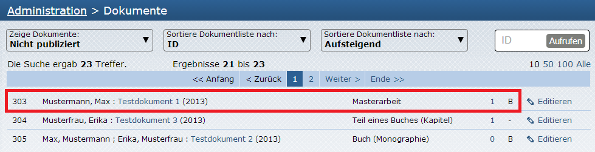
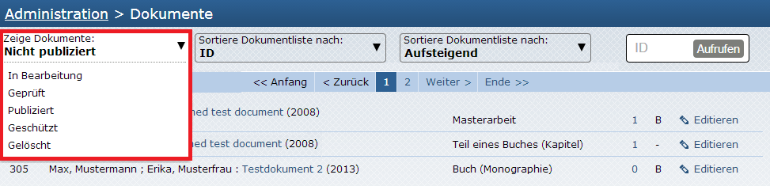
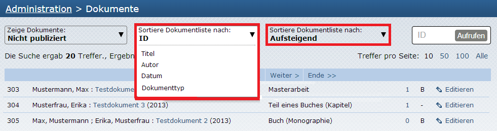
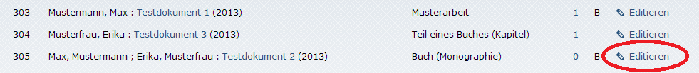

# Dokumente

Es wird standardmäßig eine Kurztitelanzeige (ID, Autor, Titel, Jahr, Dokumenttyp, Anzahl der
Dateien, Zugehörigkeit zur Bibliographie) der unveröffentlichten Dokumente angezeigt ("Nicht
publiziert"):

{:width="640px"}

Mit Klick auf das Dropdown-Menü "Zeige Dokumente" können jedoch auch mit je einem Klick
Dokumente angezeigt werden, die sich in "In Bearbeitung" befinden, "Geprüft", "Publiziert"
(bedeutet veröffentlicht), "Geschützt" oder "Gelöscht" sind:

{:width="640px"}

Zusätzlich können via Dropdown-Menü "Sortiere Dokumentliste nach" die Dokumente nach ID, Titel,
Autor, Datum oder Dokumenttyp sortiert werden, und das sowohl aufsteigend als auch absteigend:

{:width="640px"}

Ein Klick auf den Titel eines Dokuments führt zur Übersichtsseite der Metadaten über den Punkt
"Editieren" können die Daten im Metadatenformular sofort bearbeitet werden.

{:width="640px"}

## Metadatenübersicht

## Vorschau
