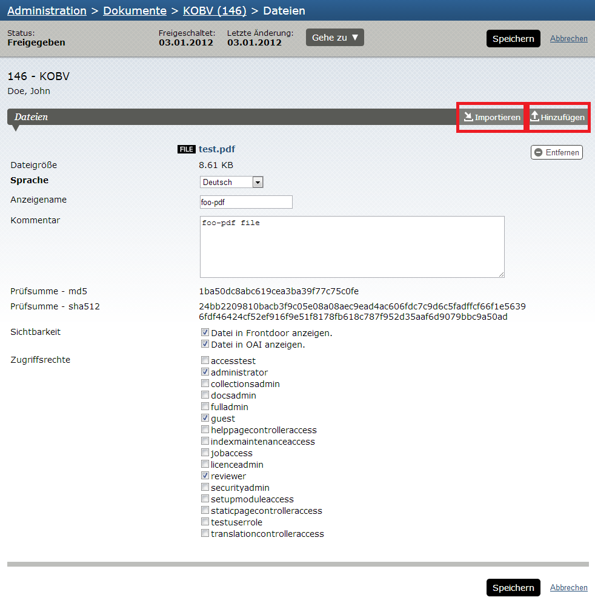
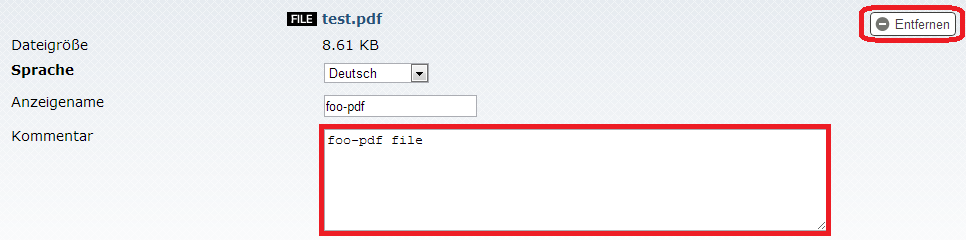
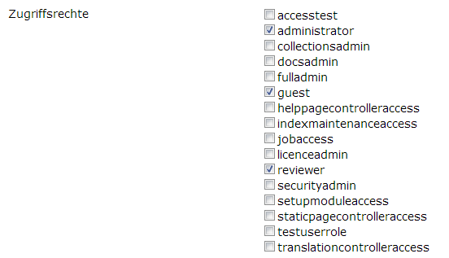
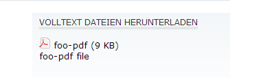
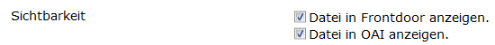
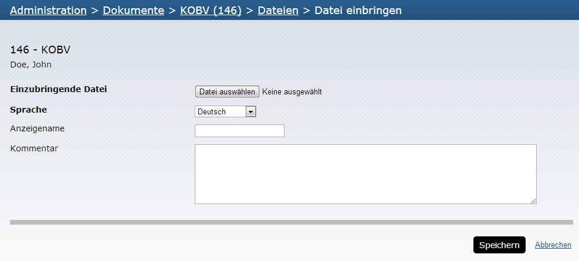
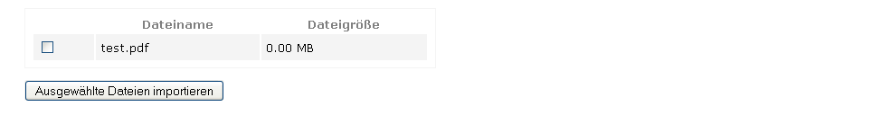

# Dateimanager

Den Dateimanager kann man aus unterschiedlichen Bereichen der Administration erreichen: jeweils
über einen Klick auf den "Dateien"-Button in der Action Box der Metadatenübersicht eines einzelnen
Dokuments sowie in der "Frontdoor" eines einzelnen Dokuments. Darüber hinaus kann man in der
Liste der Dokumente (/Administration/Dokumente) auf die Anzahl der Dateien für ein Dokument
klicken, um zum Dateimanager zu gelangen.

Im Dateimanager werden die zu einem Dokument hochgeladenen Dateien angezeigt und es besteht
die Möglichkeit, an dieser Stelle (zusätzlich oder auch nachträglich) Dateien hochzuladen und zu
löschen.

{:width="640px"}

Auf der Hauptseite werden alle Dateien für das Dokument angezeigt. Dort können alle Dateien und
die jeweils dafür benötigten Einstellungen direkt bearbeitet und abgespeichert werden. Nach dem
Abspeichern (der "Speichern"-Button befindet sich präsent sichtbar in der Action Box) wird die
Metadatenübersicht des einzelnen Dokuments angezeigt.

Darüber hinaus können Informationen zu den Dateien im Bereich "Kommentar" ergänzt und Dateien
für die Anzeige umbenannt werden ("Anzeigename"):

{:width="640px"}

Ein Klick auf den Namen der Datei öffnet diese (z.B. um sie abschließend vor dem Freischalten des
Dokuments zu prüfen).

## Zugriffsschutz für Dateien

Zu jeder Datei müssen zusätzlich die Nutzerrollen (vgl. Kapitel Nutzerrollen 160 zur Anlage und
Rechtevergabe von Nutzerrollen) angeklickt werden, die diese Datei herunterladen dürfen:

{:width="480px"}

Wird an dieser Stelle nur bestimmten Rollen der Zugriff auf die Datei erlaubt (z.B. in Verbindung mit
einem IP-Bereich, siehe Kapitel IP Adressbereiche 164 ), so wird nicht-berechtigten Nutzern die Datei
in der Frontdoor ausgegraut angezeigt:

{:width="320px"}

Soll die Datei gar nicht angezeigt werden, so kann die Option "Datei in Frontdoor anzeigen"
abgewählt werden. Damit wird die Datei weder in der Frontdoor angezeigt noch kann sie über einen
direkten Link geladen werden (Ausnahme: Administrator und Dokumentenadministrator können auch
weiterhin die Datei über einen direkten Link laden). Soll die Datei nicht über die OAI-Schnittstelle
abrufbar sein (Harvesting), muss das Häkchen bei "Datei in OAI anzeigen" entfernt werden:

{:width="640px"}

Über den "Hinzufügen" Button kommt man zu einem Formular, das dem Hochladen von Dateien
dient. Nach dem Hochladen landet man wieder auf der Hauptseite des Dateimanagers.

Die maximale Größe einer Datei, die über den Dateimanager im Admin-Bereich hochgeladen
werden kann, ergibt sich aus den Parametern post_max_size und upload_max_filesize in der
php.ini (Vgl. Kapitel 8.5 93 ).

{:width="640px"}

## Hinzufügen großer Dateien

Für sehr große Dateien (>200 MB) eignet sich der normale Datei-Upload im
Veröffentlichungsformular bzw. über den Dateimanager nicht. Daher gibt es die Möglichkeit, Dateien
(z.B. mittels eines FTP-Servers) in das Verzeichnis `$BASEDIR/workspace/incoming` zu legen. Um
die Dateien dem entsprechenden Dokument zuzuordnen, ruft man den Dateimanager auf.

Die dort abgebildete Funktion "Importieren" ruft den Dateibrowser auf, mit dem eine auf dem Server
gespeicherte Datei zum Dokument hinzugefügt werden kann.

<!-- TODO image -->

Im Dateibrowser werden alle im Ordner /incoming befindlichen Dateien angezeigt und können
ausgewählt und hinzugefügt werden:

<!-- TODO image -->

{:width="640px"}

Die Dateien müssen direkt in /incoming liegen, versteckte Dateien, Links und
Unterverzeichnisse werden ignoriert. Ebenso werden nicht erlaubte Dateiformate ignoriert.

Wenn mehrere Personen gleichzeitig Dateien im Verzeichnis /incoming ablegen oder zu
Dokumenten zuordnen möchten, können Konflikte (Fehlermeldungen) auftreten.

## Löschen aus dem Verzeichnis /incoming

Nach dem Import einer Datei aus dem Verzeichnis `$BASEDIR/workspace/incoming` wird diese
automatisch gelöscht. Dafür ist es erforderlich, dass der Apache-User Schreibrechte in dem
Verzeichnis hat. Sollte dies nicht der Fall sein, dann funktioniert der Import trotzdem, allerdings
verbleiben die hochgeladenen Dateien dann im Verzeichnis `$BASEDIR/workspace/incoming` und
müssen manuell gelöscht werden. Im Logfile `$BASEDIR/workspace/log/opus.log` erscheint aber
als Hinweis folgende Fehlermeldung:

    YYYY-MM-DDTHH:MM:SS+02:00 ERR (3, ID ...):
    could not delete file ../workspace/incoming/<Dateiname>.pdf

## Hinweise zur Speicherfunktion des Dateimanagers

Die Buttons "Speichern" und "Abbrechen" beziehen sich auf editierte Metadaten bzw.
Zugriffsrechte für Dateien.

Dagegen wirkt sich das Hinzufügen bzw. Entfernen von Dateien direkt aus.
Beim Hinzufügen (also dem Vorgang Hochladen oder Importieren) werden die Dateien sofort mit
dem Dokument verknüpft. Das heißt beim Drücken des "Abbrechen"-Buttons bleiben die neuen
Dateien erhalten. Gleiches gilt bei Löschungen von Dateien: Beim Entfernen wird nachgefragt und
nach Bestätigung dann die Löschung sofort durchgeführt. Sie kann nicht mehr rückgängig gemacht
werden.

Zu Änderungen im Metadatenformular selbst: Die Änderungen bleiben beim Wechsel zum
Dateimanager erhalten. Nach der Rückkehr zur Hauptseite sind die Änderungen also immer noch
vorhanden. Sie wurden aber noch nicht gespeichert!

