# Metadatenformular

Unterhalb der Dokumentstatusverwaltung beginnt die Übersicht aller zu diesem Dokument erfassten
Metadaten. Das Metadatenformular wurde in OPUS 4.4 stark überarbeitet: Die Daten sind nun
insgesamt in einer Maske aufgelistet. Prinzipiell können an dieser Stelle alle in OPUS4 verfügbaren
Felder (unabhängig vom Dokumenttyp) editiert oder neu hinzugefügt werden.
Das Metadatenformular ist in mehrere inhaltlich und fachlich geordnete Abschnitte eingeteilt:

* [Allgemeines](#allgemeines)
* [Personen](#personen)
* [Titelinformationen](#titelinformationen)
* [Bibliographische Informationen](#bibliographische-informationen)
* [Schriftenreihen](#schriftenreihen)
* [Benutzerdefinierte Felder (Enrichments)](#benutzerdefinierte-felder-enrichments)
* [Sammlungen, Klassifikationen](#sammlungen-klassifikationen)
* [Inhaltliche Erschließung](#inhaltliche-erschlieung)
* [Identifier](#identifier)
* [Lizenzen](#lizenzen)
* [Patente](#patente)
* [Bemerkungen](#bemerkungen)
* [Dateien](#dateien)

Um direkt zu den einzelnen Abschnitten des Metadatenformulars zu gelangen kann man das
Dropdownmenü "Gehe zu Abschnitt" nutzen.

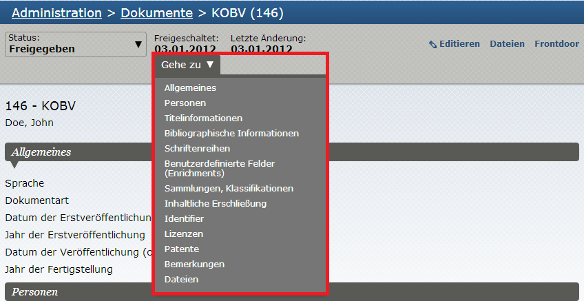{:width="640px"}

Über den Button "Editieren" im oberen Bereich der Übersicht eines einzelnen Dokuments (hier im
Beispiel das Dokument 146) gelangt man in die Bearbeitungsmaske der Metadaten:

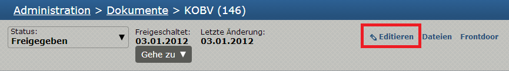{:width="640px"}

Sind alle gewünschten Änderungen eingetragen kann über den Button "Speichern" im
Übersichtsbereich des Metadatenformulars der Stand gesichert oder verworfen werden.

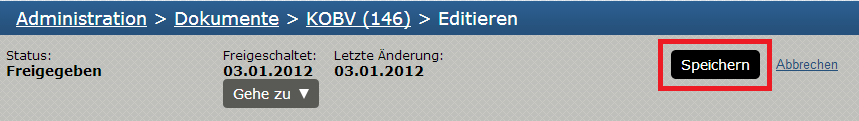{:width="640px"}

Springt man nicht von Abschnitt zu Abschnitt, sondern scrollt durch das Metadatenformular, befindet
sich am Ende der Seite ebenfalls eine Möglichkeit zur Sicherung oder zum Verwerfen der
Änderungen.

Die erfolgreiche Speicherung der Änderungen im Metadatenformular wird bestätigt mit:

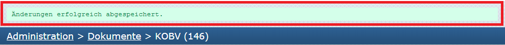{:width="640px"}

## Allgemeines

In diesem Bereich werden die Sprache des Dokuments, die Dokumentart sowie Datumsangaben
zum Dokument aufgeführt.
Über den Button "Editieren" können Angaben hinzugefügt, geändert oder gelöscht werden.

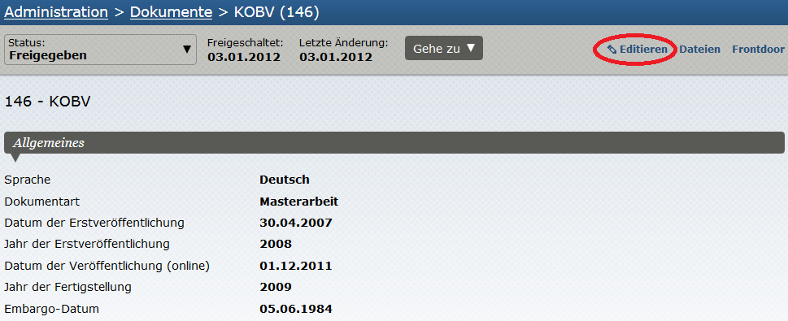{:width="640px"}

Im Bearbeitungsmodus kann nachträglich die Sprache des Gesamtdokuments und die Dokumentart
geändert werden. Darüber hinaus können die Datumsangaben des Dokuments bearbeitet bzw.
eingesehen werden. Da es all diese Felder jeweils nur einmal geben kann, entfällt die Funktion "Neu
hinzufügen".

"Sprache" und "Dokumentart" sind Pflichtfelder und werden hier immer aufgeführt. Sie können über
die Dropdownmenüs geändert werden. Falls "Datum der Erstveröffentlichung", "Jahr der
Erstveröffentlichung", "Datum der Veröffentlichung (online)" oder "Jahr der Fertigstellung" nicht belegt
sein sollten, werden sie in der Übersicht auch nicht angezeigt. Durch Klick auf die Eingabefelder
lassen sie sich auch nachträglich befüllen.

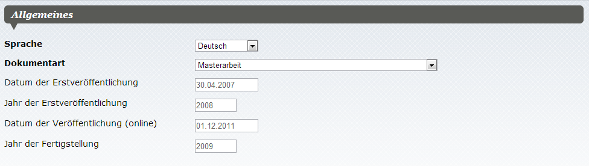{:width="640px"}

Die Felder "Datum der Freischaltung" und "Datum der letzten Änderung (Server)" - angeordnet in
der Übersicht des Metadatenformulars - sind interne Felder und können nicht verändert werden.

## Personen

In diesem Bereich werden die Personen des Dokuments aufgeführt. Dazu gehören Verfasserangaben
(Autoren), Herausgeber, Übersetzer, Sonstige beteiligte Personen, Weitere Personen, Betreuer,
Gutachter und Einsteller.

Über den Button "Editieren" können Angaben hinzugefügt, geändert oder gelöscht werden.

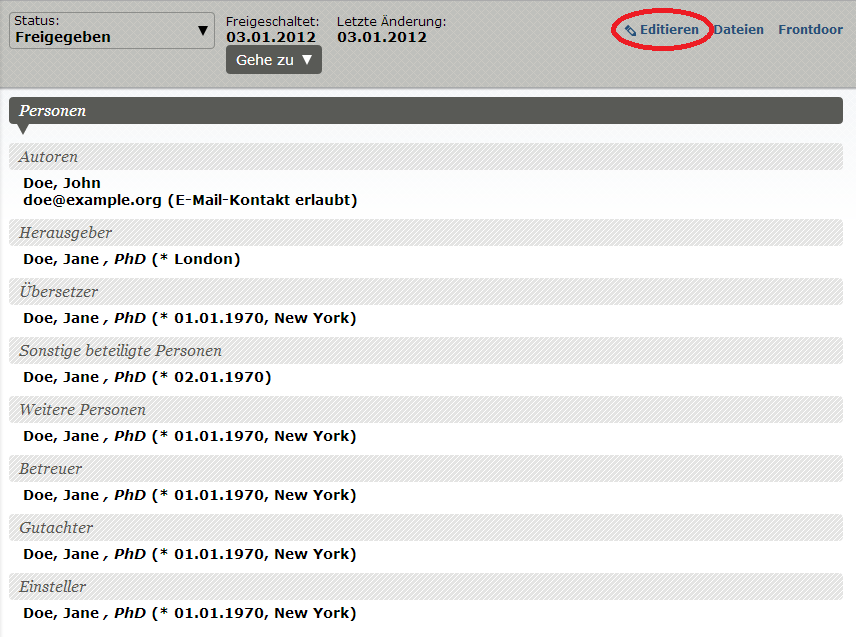{:width="640px"}

### Personen bearbeiten

Im Bearbeitungsmodus können existierende Personen geändert werden.

Die Änderungen werden erst durch das Anklicken des "Speichern"-Buttons wirksam!

Über das Dropdownmenü "Aktionen" können neue Rollen für die einzelnen Personen erteilt werden.

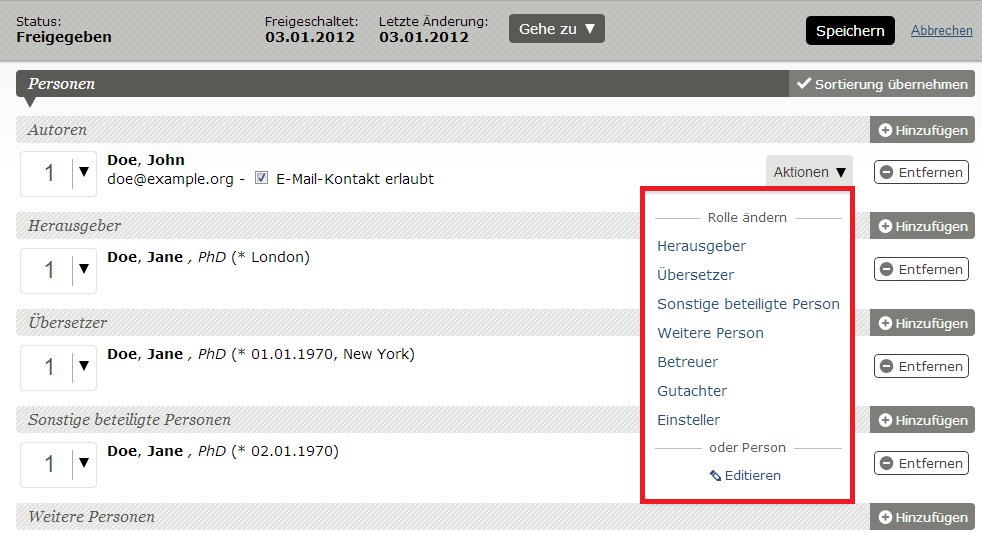{:width="640px"}

Ist mehreren Personen die gleiche Rolle zugewiesen, kann die Sortierung der Personen verändert
werden - sie werden entweder über die Pfeile neben der Sortierungszahl in Position gesetzt oder
manuell durch das Zuweisen einer neuen Sortierungszahl im Eingabefeld angepasst.

Durch Klick auf den Button "Sortierung übernehmen" wird die Reihenfolge der Personen gespeichert.

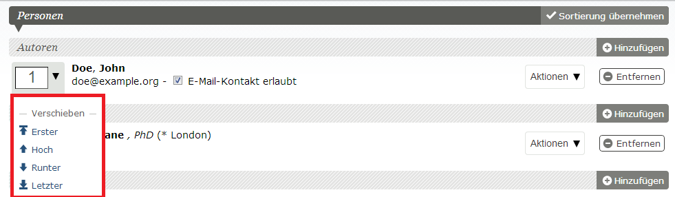{:width="640px"}

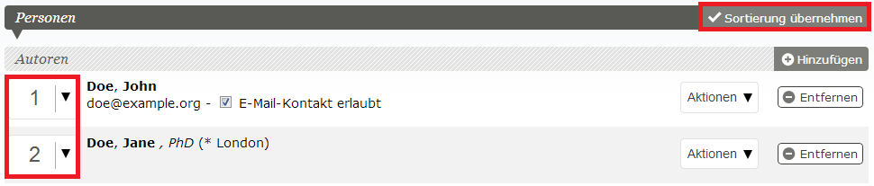{:width="640px"}

Über das Dropdownmenü "Aktionen" können auch die persönlichen Angaben zu jeder einzelnen
Person über "Person editieren" geändert werden.

Für diesen Vorgang öffnet sich eine neue Maske im gleichen Fenster, in der nun durch Klick in die
Eingabefelder die persönlichen Angaben zur Person (Vorname(n), Nachname, Akademischer Titel,
E-Mail-Adresse, Geburtstort, Geburtsdatum) angepasst bzw. hinzugefügt werden können.

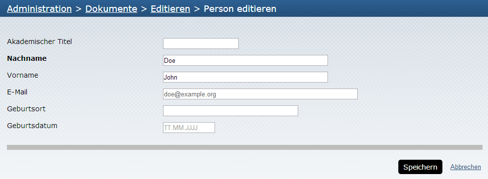{:width="640px"}

Durch Klick auf den Button "Speichern" werden die Änderungen übernommen. Es wird zeitgleich
eine Neuindexierung des Dokuments ausgelöst. Anschließend wird man auf die allgemeine
Bearbeitungsseite zum Abschnitt Personen zurück geleitet.

Existierende Personen können im Bearbeitungsmodus auch einzeln entfernt werden:

{:width="640px"}

Durch das Entfernen von Personen wird auch eine Neuindexierung des Dokuments ausgelöst.

Achtung: Das Entfernen wird sofort wirksam!

### Personen neu hinzufügen

Mit Klick auf "Hinzufügen" können Personen einzeln für die jeweilige Rolle neu hinzugefügt werden.

Für diesen Vorgang öffnet sich ebenfalls eine neue Maske im gleichen Fenster, in der nun durch
Klick in die Eingabefelder die persönlichen Angaben zur Person (Vorname(n), Nachname,
Akademischer Titel, E-Mail-Adresse, Geburtstort, Geburtsdatum) sowie die Rolle (Funktion) und die
Sortierreihenfolge eingegeben werden können. Mit "E-Mail-Kontakt erlaubt" wird festgelegt, ob in der
Einzelansicht zum Dokument (Vorschau Frontdoor 112 ) die Möglichkeit gegeben wird, den Autor per
E-Mail zu kontaktieren:

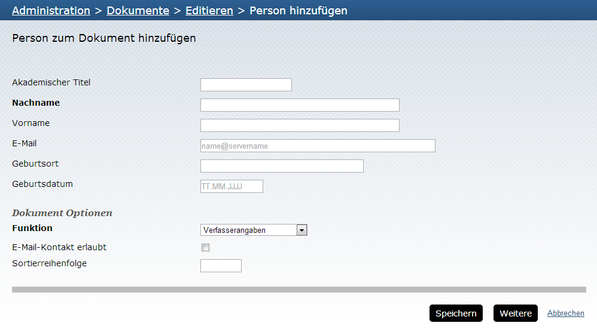{:width="640px"}

Durch Klick auf den Button "Speichern" werden die Angaben gesichert. Es wird eine Neuindexierung
des Dokuments ausgelöst. Anschließend wird man auf die allgemeine Bearbeitungsseite zum
Abschnitt Personen zurück geleitet.

Durch Klick auf den Button "Weitere" werden die Angaben zur ersten neu hinzugefügten Person
gesichert. Es wird eine Neuindexierung des Dokuments ausgelöst. Anschließend verbleibt man im
Eingabeformular, die Felder sind wieder auf "default" gesetzt (und damit leer). Es kann eine weitere
Person hinzugefügt werden. Die Daten werden über den Button "Speichern" gesichert. Anschließend
wird man auf die allgemeine Bearbeitungsseite zum Abschnitt Personen zurück geleitet.

## Titelinformationen

In diesem Bereich werden die Titelinformationen des Dokuments aufgeführt. Dazu gehören (Haupt-)
Titel, Titel des übergeordneten Werkes (z.B. einer Zeitschrift oder eines Sammelbandes), Untertitel
und übersetzte Titel jeweils in den entsprechenden Sprachen.

Über den Button "Editieren" können neue Titel hinzugefügt sowie bestehende bearbeitet oder
gelöscht werden.

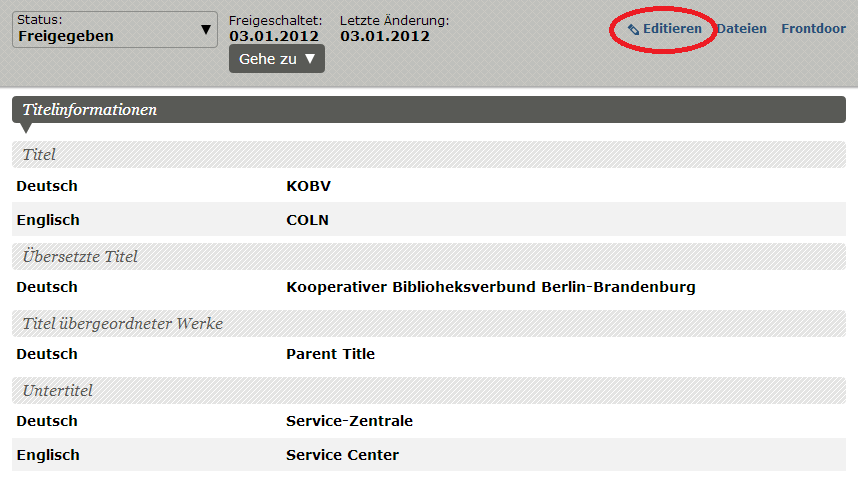{:width="640px"}

### Titelinformationen bearbeiten

Im Bearbeitungsmodus können existierende Titel durch einfaches Überschreiben des Textes in den
Eingabefeldern geändert werden. Über das Dropdownmenü links vom Eingabefeld kann auch noch
die jeweilige Sprache des Titels angepasst werden.

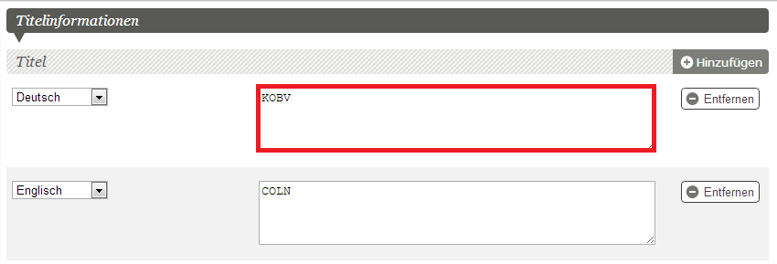{:width="640px"}

Die Änderungen werden erst durch das Anklicken des "Speichern"-Buttons wirksam!

Zudem können existierende Titel einzeln entfernt werden:

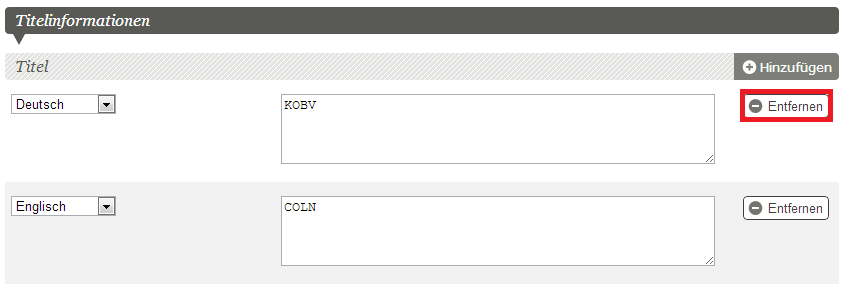{:width="640px"}

Achtung: Das Entfernen wird sofort wirksam!

Durch das Speichern bzw. das Entfernen wird eine Neuindexierung des Dokuments ausgelöst.

### Titelinformationen neu hinzufügen

Nach einem Klick auf "Hinzufügen" können Titel einzeln für die jeweilige Kategorie (Titelart) neu
hinzugefügt werden.

Für diesen Vorgang wird unter eventuell bereits bestehenden Titeln der Kategorie eine weitere leere
Eingabemaske angefügt:

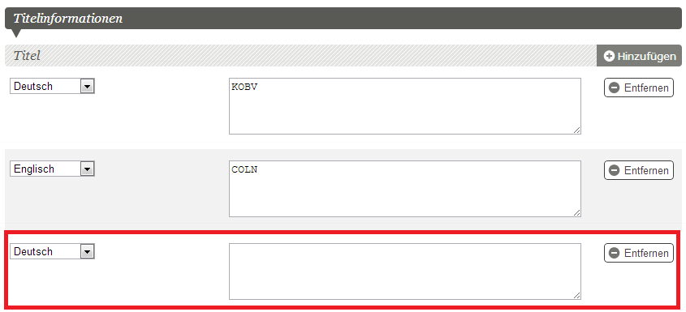{:width="640px"}

Nun kann durch Klick in das Eingabefeld ein Titel im Wortlaut eingefügt werden. Über das
Dropdownmenü links vom Eingabefeld kann die jeweilige Sprache des Titels eingestellt werden.

Auch hier wird durch den Klick auf "Speichern" eine Neuindexierung des Dokuments ausgelöst.

Die Änderungen werden erst durch das Anklicken des "Speichern"-Buttons wirksam!

## Bibliographische Informationen

In diesem Bereich können bibliographische Informationen des Dokuments bearbeitet bzw.
eingesehen werden.

Es verzeichnet einerseits direkte Angaben zum Werk (wie z.B. Verlag, Verlagsort oder Seitenzahl).
Da es diese Felder jeweils nur einmal geben kann, entfällt die Funktion "Hinzufügen". Im Beispiel
sind alle Felder belegt und werden daher angezeigt. Durch Klick auf "Editieren" lassen sich auch
nachträglich Felder befüllen bzw. bearbeiten.

Andererseits vermerkt es auch die als "Veröffentlichende Institutionen" und "Titel verleihende
Institutionen" beteiligte Hochschulen (vgl. auch Kapitel Verbreitende Stelle und Vergabeinstitution
(DNB)) 156 . Im Beispiel sind alle Felder belegt und werden daher angezeigt. Durch Klick auf
"Editieren" lassen sich auch nachträglich Felder bearbeiten oder neue Institutionen hinzufügen.

{:width="640px"}

### Bibliographische Informationen bearbeiten

Diese Funktion verhält sich analog zu "Titelinformationen (bearbeiten)" 126.

### Bibliographische Informationen neu hinzufügen

Diese Funktion verhält sich analog zu "Titelinformationen (neu hinzufügen)" 126.

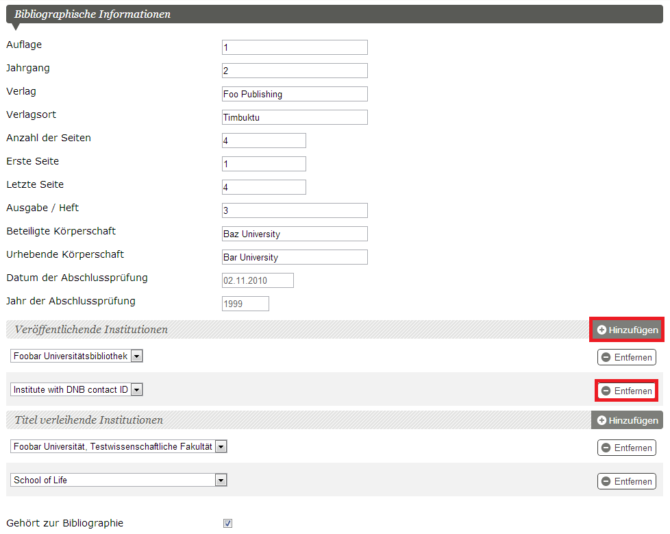{:width="640px"}

## Schriftenreihen

In diesem Bereich kann die Zuordnung des Dokuments zu Schriftenreihen bearbeitet werden.

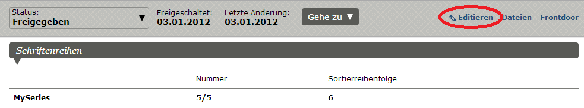{:width="640px"}

### Schriftenreihen bearbeiten

Bereits vorgenommene Zuordnungen können analog zu "Titelinformationen (bearbeiten)" 126
bearbeitet werden. Einen Unterschied stellt hier das Feld "Sortierreihenfolge" dar, mit welchem
Einfluss auf die Position des Dokuments als Band innerhalb der Schriftenreihe bei deren Anzeige im
Browsing genommen werden kann (vgl. hierzu auch das Kapitel Sortierreihenfolge ändern 149 , in dem
dieser Vorgang für die Schriftenreihen selbst beschrieben ist).

### Schriftenreihen neu hinzufügen

Diese Funktion verhält sich analog zu "Titelinformationen (neu hinzufügen)

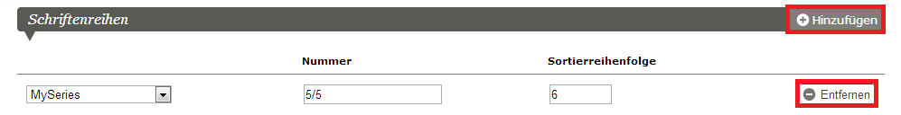{:width="640px"}

## Benutzerdefinierte Felder (Enrichments)

Hier können benutzerdefinierte Felder (Enrichments) angezeigt und angepasst werden (vgl. hierzu
auch das Kapitel Benutzerdefinierte Felder (EnrichmentsKeys) 166 , in dem beschrieben ist, wann und
wie benutzerdefinierte Felder angelegt werden können).

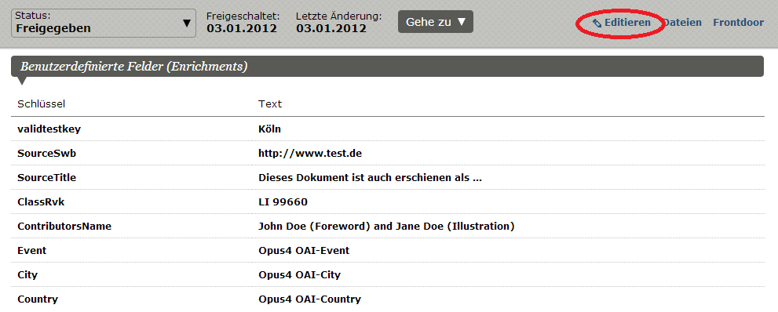{:width="640px"}

### Benutzerdefinierte Felder (Enrichments) bearbeiten

Diese Funktion verhält sich analog zu "Titelinformationen (bearbeiten)" 126.

### Benutzerdefinierte Felder (Enrichments) neu hinzufügen

Diese Funktion verhält sich analog zu "Titelinformationen (neu hinzufügen)" 126.

Bearbeitungsmodus des Metadatenformulars für den Bereich Benutzerdefinierte Felder (Enrichments)

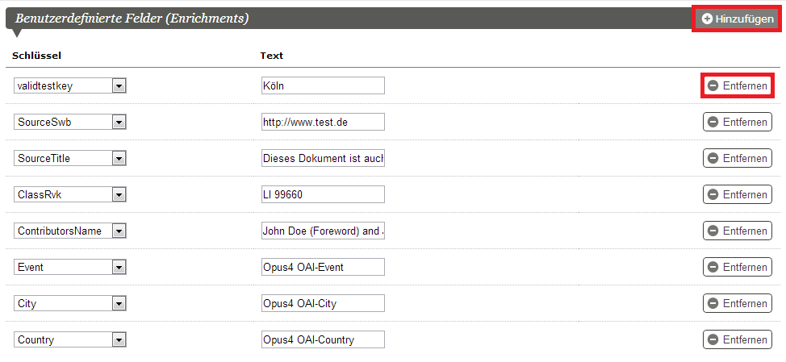{:width="640px"}

## Sammlungen, Klassifikationen

In diesem Bereich erfolgt die Zuordnung des Dokuments zu Sammlungen und Klassifikationen.

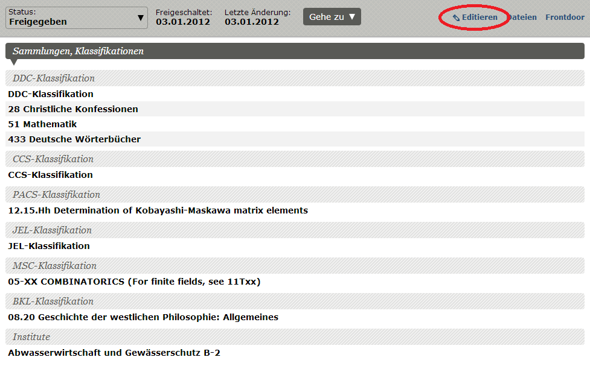{:width="640px"}

### Sammlungen und Klassifikationen bearbeiten

Nach einem Klick auf "Editieren" erhält man eine Übersicht der aktuellen Zuordnungen von
Sammlungen und Klassifikationen zum Dokument:

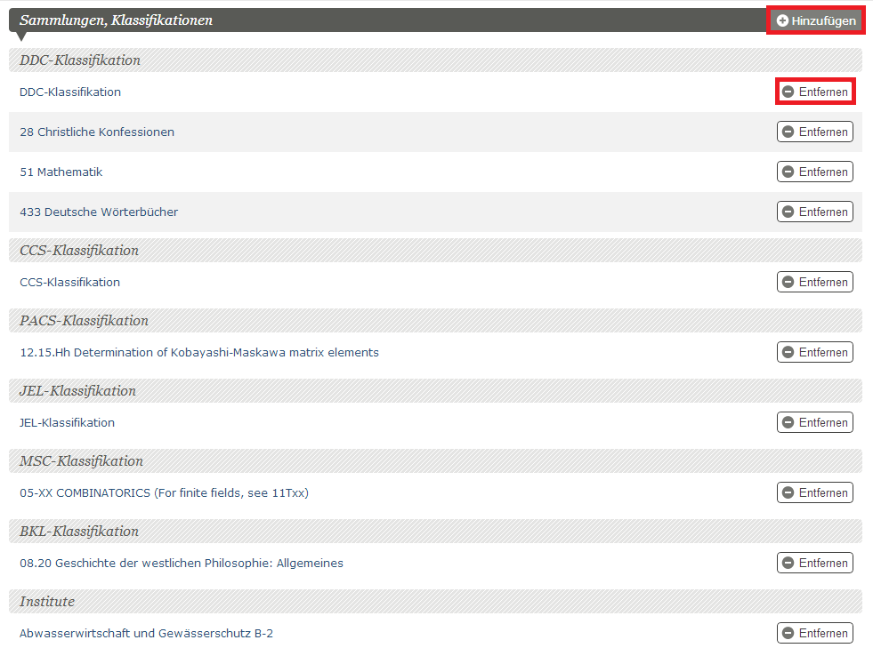{:width="640px"}

Die aufgelisteten Zuordnungen können einzeln durch einen Klick auf "Entfernen" gelöscht werden.

Sollen dem Dokument neue Sammlungen oder Klassifikationen zugeordnet werden, klickt man auf
den Button "Hinzufügen".

Für diesen Vorgang öffnet sich eine neue Maske im gleichen Fenster, in der nun alle existierenden
Sammlungen und Klassfikationen (vgl. Kapitel Sammlungen 140 für mehr Informationen) aufgeführt
werden.

Die einzelnen Sammlungen und Klassifikationen sind unterschiedlich tief erschlossen. Mit Klick auf
den Wert selbst (z.B. DDC-Klassifikation) öffnet sich die nächst tiefer liegende Ebene in der
Hierarchie. Wo man sich in der Hierarchie jeweils befindet, kann man anhand eines Reiters, der sich
unter dem Dokumententitel befindet, ersehen. Darüber kann man ebenfalls durch die Hierarchie
navigieren.

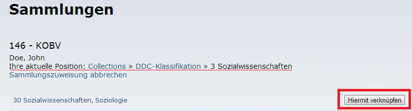{:width="640px"}

Ist die letzte Ebene erreicht, wird der Wert schwarz eingefärbt. Die Zuordnung erfolgt durch einen
Klick auf "Hiermit verknüpfen". Die Sammlung oder der ausgewählte Sammlungsbegriff wird
übernommen. Man wird wieder auf das Metadatenformular zurückgeleitet.

## Inhaltliche Erschließung

In diesem Bereich können einerseits die Abstracts des Dokuments, andererseits die Schlagwörter,
die für das Dokument vergeben sind oder werden, eingesehen und bearbeitet werden.

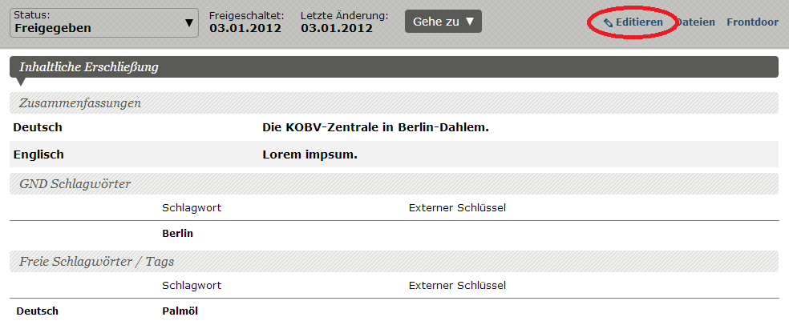{:width="640px"}

### Inhaltliche Erschließung, Felder bearbeiten

Diese Funktion verhält sich analog zu "Titelinformationen (bearbeiten)" 126.

### Inhaltliche Erschließung, Felder neu hinzufügen

Diese Funktion verhält sich analog zu "Titelinformationen (neu hinzufügen)

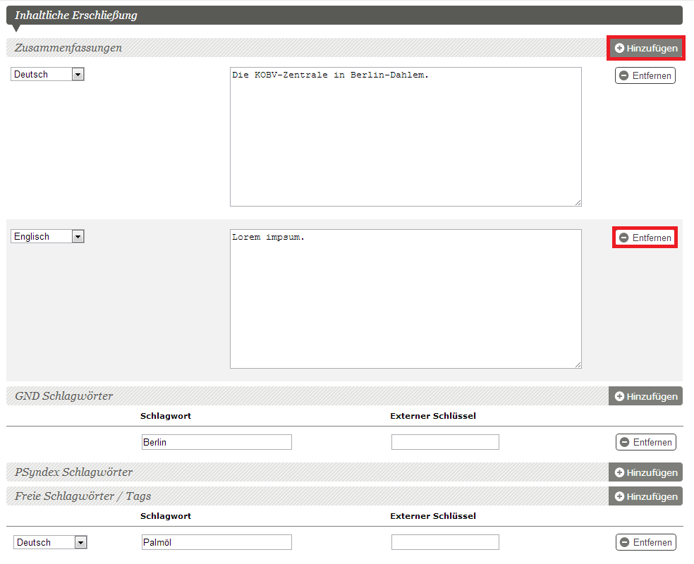{:width="640px"}

## Identifier

In diesem Bereich können die Identifier des Dokuments bearbeitet werden. Die Liste der Identifier ist
vom System vorgegeben. Eine Änderung bzw. Erweiterung kann nicht erfolgen.

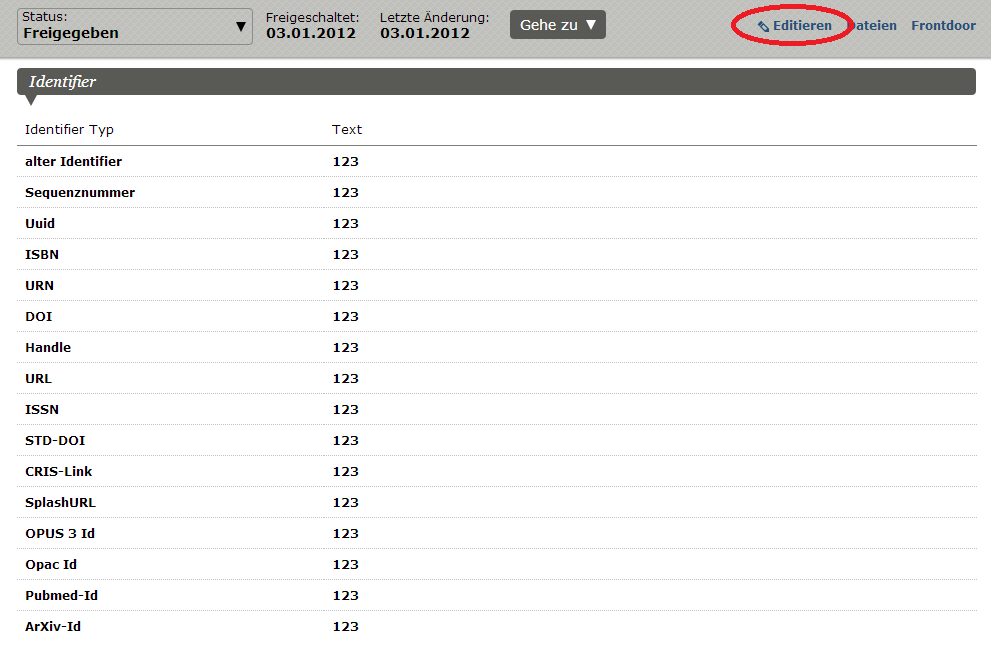{:width="640px"}

### Identifier bearbeiten

Diese Funktion verhält sich analog zu "Titelinformationen (bearbeiten)" 126.

### Identifier neu hinzufügen

Diese Funktion verhält sich analog zu "Titelinformationen (neu hinzufüge

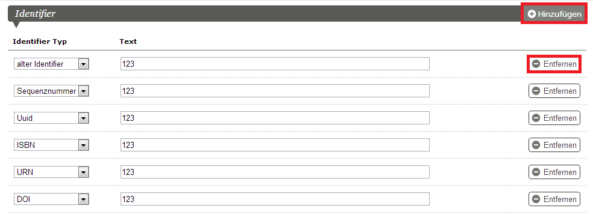{:width="640px"}

## Lizenzen

In diesem Bereich kann die Zuordnung der Lizenzen zum Dokument bearbeitet werden.

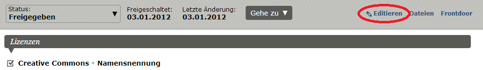{:width="640px"}

### Lizenzen bearbeiten

Klickt man auf den Button "Editieren" gelangt man zur Bearbeitungsmaske des Metadatenformulars.
Mit dem Setzen oder Entfernen eines Häkchens kann man dem Dokument einzelne Lizenzen
zuweisen bzw. diese entfernen.

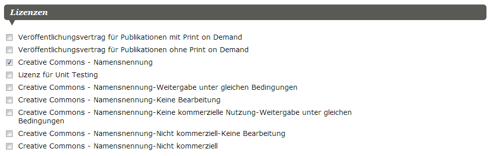{:width="640px"}

Die Änderungen werden erst durch das Anklicken des "Speichern"-Buttons wirksam!

### Lizenzen verwalten

Diese Funktion wird in Kapitel "Lizenzen" 152 erläutert.

## Patente

In diesem Bereich können die Patente des Dokuments bearbeitet werden.

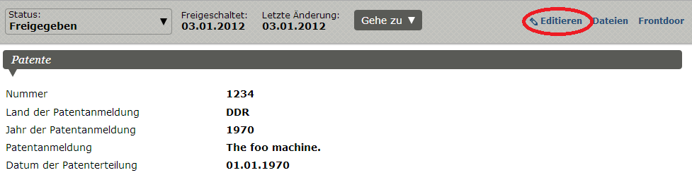{:width="640px"}

### Patente bearbeiten

Diese Funktion verhält sich analog zu "Titelinformationen (bearbeiten)" 126.

### Patente neu hinzufügen

Diese Funktion verhält sich analog zu "Titelinformationen (neu hinzufügen)

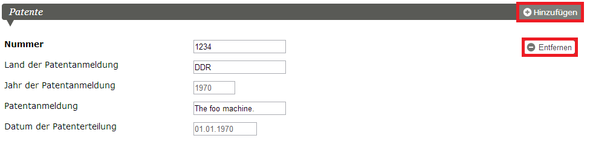{:width="640px"}

## Bemerkungen

In diesem Bereich können Bemerkungen zum Dokument eingesehen, bearbeitet und neu hinzugefügt
werden.

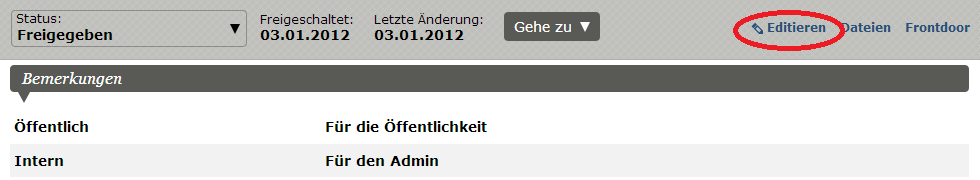{:width="640px"}

### Bemerkungen bearbeiten

Diese Funktion verhält sich analog zu "Titelinformationen (bearbeiten)" 126.

### Bemerkungen neu hinzufügen

Diese Funktion verhält sich analog zu "Titelinformationen (neu hinzufügen)" 126.

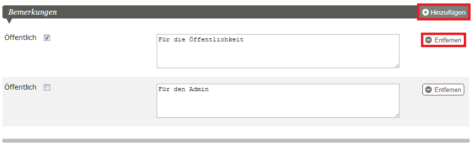{:width="640px"}

Wird der Status "Öffentlich" gewählt, dann ist die Bemerkung auf der Frontdoor des Dokuments
sichtbar.

## Dateien

In diesem Bereich wird eine Übersicht zu den zum Dokument gehörenden Dateien gegeben.

<!-- TODO image -->

### Dateien hinzufügen, bearbeiten und entfernen

Diese Funktion - erreichbar über den "Dateien"-Button in der Action Box der Metadatenübersicht -
wird im Kapitel Vorschau und Dateienmanager 112 näher erläutert.
