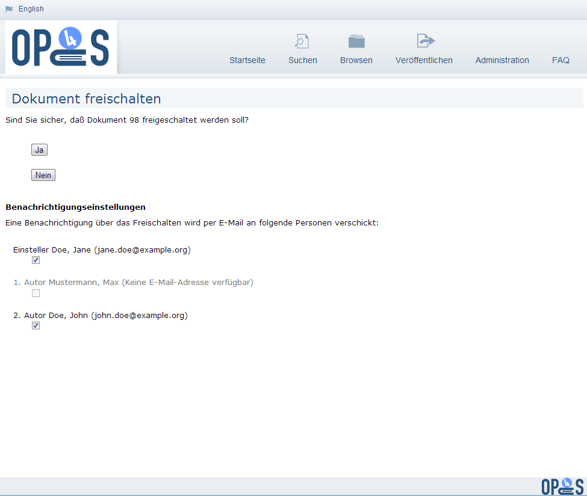

# Mail

Die folgenden Einstellungen legen fest, welche E-Mailadresse benutzt wird, wenn OPUS4 Mails
verschickt:


; MAIL SETTINGS
; mail.opus.smtp = localhost ; SMTP server for sending email
; mail.opus.port = 25 ; SMTP server port for sending email
mail.opus.address = <E-Mail-Adresse, z.B. noreply@bibliothekxyz.de>
mail.opus.name = <Name, z.B. BibliothekXYZ>


## Benachrichtigungen (Notification)

In OPUS4 kann eine Benachrichtigungsfunktion konfiguriert werden. Das System kann dann zu den
Ereignissen "Submission" (Neues Dokument wurde eingestellt) und "Publication" (Dokument wurde
freigeschaltet) E-Mails an vorher festgelegte E-Mail-Adressen verschicken.
Grundsätzlich ist die Benachrichtigungsfunktion per Default deaktiviert. Sie kann getrennt für die
Ereignisse "Submission" und "Publication" in der config.ini aktiviert werden, indem die
entsprechenden Schlüssel aus der `config.ini.template` kopiert und die Kommentarzeichen entfernt
werden:


;NOTIFICATION SETTINGS
; comma separated list of email addresses that should receive a
; submission notification email
notification.document.submitted.email = ""

; comma separated list of email addresses that should receive a
; publication notification email
notification.document.published.email = ""

; uncomment the next line if notification emails should be sent
; if a new document is submitted
notification.document.submitted.enabled = 1

; uncomment the next line if notification emails should be sent
; if a document is published
notification.document.published.enabled = 1


Zusätzlich ist es notwendig, dass der generelle Mailversand in den [Mail Einstellungen](#Mail) konfiguriert
ist.

### Konfiguration der "Submission"-Benachrichtigung

1\. Benachrichtigungsfunktion aktivieren, indem das Kommentarzeichen vor dem Schlüssel
`notification.document.submitted.enabled = 1` entfernt wird:


;NOTIFICATION SETTINGS
; uncomment the next line if notification emails should be sent
; if a new document is submitted
notification.document.submitted.enabled = 1


2\. Den Schlüssel notification.document.submitted.email aktivieren und die E-Mail-Adressen
eintragen, an die die Submission-Mail verschickt werden soll. Mehrere Adressen werden durch
Komma getrennt:


;NOTIFICATION SETTINGS
; comma separated list of email addresses that should receive a
; submission notification email
notification.document.submitted.email = "mustermann@example.org,musterfrau@example.org,bibliothek@unixyz.de"


### Konfiguration der "Publication"-Benachrichtigung

1\. Benachrichtigungsfunktion aktivieren, indem das Kommentarzeichen vor dem Schlüssel
`notification.document.published.enabled = 1` entfernt wird:


;NOTIFICATION SETTINGS
; uncomment the next line if notification emails should be sent
; if a document is published
notification.document.published.enabled = 1


2\. Den Schlüssel notification.document.published.email aktivieren und die E-Mail-Adressen
eintragen, an die die Publication-Mail verschickt werden soll. Mehrere Adressen werden durch
Komma getrennt:


;NOTIFICATION SETTINGS
; comma separated list of email addresses that should receive a submission
notification email
notification.document.submitted.email = "mustermann@example.org,musterfrau@example.org,bibliothek@unixyz.de"


### Konfiguration der E-Mail-Inhalte (Subject und Body)

Der Inhalt der E-Mails wird über PHP-Templates gesteuert. In der Standardauslieferung sind im
Verzeichnis `$BASEDIR/application/configs/mail_templates` zwei Templates enthalten:

    submitted.phtml
    published.phtml

Diese sollten nicht verändert werden, da sie beim Update überschrieben werden. Ist eine
Veränderung gewünscht, so sollten in dem gleichen Verzeichnis neue Templates angelegt werden.
Die Aktivierung dieser Templates erfolgt dann durch Angabe des Dateinamens im Schlüssel
`notification.document.submitted.template` bzw. im Schlüssel
`notification.document.published.template`, die in die `config.ini` eingetragen werden müssen:


notification.document.submitted.template = "my_submitted.phtml"
notification.document.published.template = "my_published.phtml"


In den Templates stehen vier Variablen zur Verfügung:

* `$authors` (Array der Autorennamen)
* `$title` (Haupttitel in Dokumentsprache)
* `$docId` (Dokument-ID)
* `$url` (Deeplink auf Administration (bei Submission-Mail) bzw. Frontdoor (bei Publication-Mail))

Der Betreff der E-Mails kann ebenfalls verändert werden über die Schlüssel
`notification.document.submitted.subject` bzw.
`notification.document.published.subject`, die in die `config.ini` eingetragen werden müssen. Die
Standardeinstellungen lauten:


notification.document.submitted.subject = "Dokument #%1$s im OPUS4-Dokumentenserver eingestellt: %2$s : %3$s"
notification.document.published.subject = "Dokument #%1$s im OPUS4-Dokumentenserver veröffentlicht: %2$s : %3$s"


Die Platzhalter bezeichnen dabei:

| Platzhalter | Beschreibung |
|-------------+--------------|
| %1$s | Dokument-ID |
| %2$s | Liste der Autorennamen (getrennt durch Semikolon) |
| %3$s | Haupttitel in Dokumentsprache |

Sind keine Autoren bzw. kein Haupttitel vorhanden, wird "n/a" ausgegeben.

Die "Submission"-Benachrichtigung übernimmt direkt die Eingaben bezüglich Haupttitel und
Autorennamen aus dem Formular. Ein Benutzer kann hier durchaus beliebigen Inhalt eintragen,
also auch HTML-Markup oder beliebige URLs, die beim Anklicken Schaden verursachen können
(z.B. Phishing). Die Benachrichtigungs-E-Mails werden zwar mit `Content-Type: text/plain;
charset=utf-8` ausgeliefert, es sollte aber dennoch darauf hingewiesen werden, dass nur der
OPUS4-Deeplink in der Mail angeklickt wird (da einige Mail-Clients, z.B. Thunderbird, automatisch
auch URLs in text/plain-Mails als Link anbieten).

### Benachrichtigung von Autor(en) und Einsteller

Ist die "Publication"-Benachrichtigung aktiviert, kann zusätzlich der Einsteller (Submitter) und jeder
Autor des Dokuments eine E-Mail (einzeln) erhalten, sofern für diese im System eine E-Mailadresse
hinterlegt ist.

Hierfür wird beim Freischalten eines Dokuments nachgefragt, wer eine E-Mail erhalten soll:

{:width="640px"}

Für den Fall, dass es sich bei Einsteller und Autor um dieselbe Person handelt, wird nur einmal eine
E-Mail verschickt.

ACHTUNG: In OPUS4 erscheint beim Freischalten (Publizieren) eines Dokumentes eine
Zwischenseite, in der um Bestätigung des Vorganges gebeten wird. Die Konfigurationseinstellung
für diese Bestätigungsseite wird ebenfalls in der `config.ini` festgelegt (der Defaultwert = 1 sorgt
dafür, dass die Bestätigungsseite erscheint).
Seit OPUS 4.4.1 ist es möglich diese Seite mit der Konfigurationseinstellung
`confirmation.document.statechange.enabled = 0` auszuschalten. Damit stehen dann auch die
oben beschriebenen Funktionen nicht zur Verfügung, da OPUS4 sich die Änderung des Status
eines Dokuments nicht mehr bestätigen lässt, sondern diese sofort durchführt.

## Benachrichtigungen bei Applikationsfehlern

Hier kann eingetragen werden, an wen Fehlermeldungen per Mail verschickt werden.


;ERROR CONTROLLER SETTINGS - who should receive error mails?
errorController.mailTo.name = Name
errorController.mailTo.address = E-Mail-Adresse

