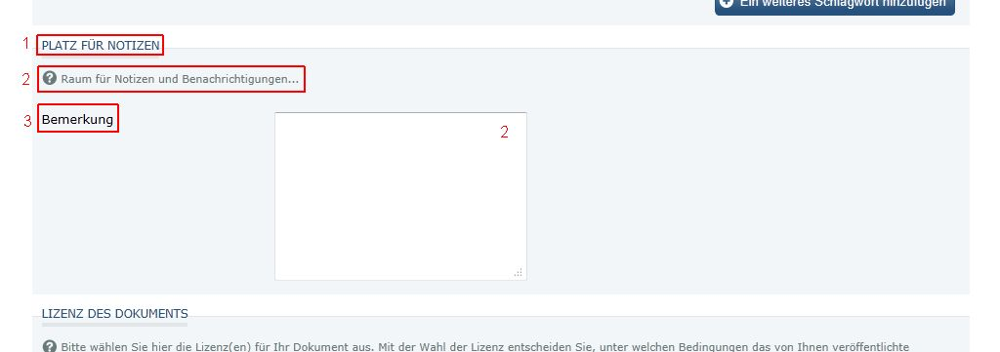

# Felder

OPUS4 liefert standardmäßig bereits über 50 Felder (s. Anhang 229 ) aus, die in den Dokumenttypen
zur Erfassung von Metadaten verwendet werden können. Darüber hinaus können neue Felder definiert
werden, um lokale oder sehr spezifische Sachverhalte abzuspeichern (z.B. eine lokale ID). Es gibt
grundsätzlich zwei verschiedene Ausprägungen von Feldern (s.a. Anhang 233 ):

* einfache Felder (dürfen pro Dokument nur einmal vorhanden sein)
* Gruppenfelder (bestehen entweder aus mehr als einem Feld (siehe z.B. Title + Sprache) oder
  können mehrfach pro Dokument vorkommen)

Da auch bei den Bezeichnungen der Felder (z.B. auf der Frontdoor oder im Veröffentlichungsformular)
Übersetzungsressourcen zum Einsatz kommen, besteht die Möglichkeit vorhandene Felder umzubenennen.

Die Bearbeitung von Übersetzungsressourcen sowie statischer Seiten ist seit Version 4.4 über
die Opus4-Oberfläche möglich. Näheres dazu ist in Kapitel Übersetzungsressourcen 65
beschrieben.

## Vorbereitung

Um lokale Anpassungen an den Bezeichnung von vorhandenen oder neuen Feldern vorzunehmen, ist
es dringend empfehlenswert, sich lokale Sprachdateien in den entsprechenden Modulen anzulegen
und nicht die ausgelieferten zu verändern. Der Vorteil bei lokalen Sprachdateien liegt darin, dass
diese bei Updates erhalten bleiben.

Bitte also die folgenden Sprachdateien einmalig im Verzeichnis
$BASEDIR/opus4/modules/publish/language_custom/ anlegen oder die mitgelieferte
ex ample.tmx .template wie im Kapitel Übersetzungsressourcen 65 beschrieben modifizieren:

my_field_header.tmx
my_field_hints.tmx
my_fieldnames.tmx

Damit die geänderten Felder auch im Administrationsbereich korrekt angezeigt werden, muss
folgende Datei im Verzeichnis $BASEDIR/opus4/modules/default/language_custom/ angelegt
werden:

my_fieldnames.tmx

Sollen auch Gruppenfelder verändert bzw. neu angelegt werden, muss zusätzlich folgende Datei im
Verzeichnis $BASEDIR/opus4/modules/publish/language_custom/ angelegt werden:

my_buttons.tmx

Es ist vollkommen unerheblich, wie die Dateien heißen. Wichtig ist nur der Ablageort
$BASEDIR/opus4/modules/(modulname)/language_custom/! Darüber hinaus ist es essentiell,
dass die .tmx-Dateien in UTF-8 codiert sind (um dies sicherzustellen, eignet sich z.B. der Open-
Source-Editor Notepad++, bei dem vor der Bearbeitung einer Datei die Kodierung auf UTF-8
umgestellt werden kann.

## Felder umbenennen

Bei jedem Feld können die Übersetzungen an drei Stellen geändert werden, nämlich für:

1. den Titel / die Überschrift des Feldes
2. den Hilfetext des Feldes und
3. den Namen / die Bezeichnung des Feldes

{:width="640px"}

Im Folgenden werden die Änderungen am Bsp. des Feldes Note verdeutlicht.

### 1. Titel / Überschrift des Feldes ändern

Um den Titel des Feldes Note zu ändern, wird der Schlüssel header_note aus der Sprachdatei
$BASEDIR/opus4/modules/publish/language/field_header.tmx in die Sprachdatei
$BASEDIR/opus4/modules/publish/language_custom/my_field_header.tmx kopiert und wie
folgt angepasst:

Defaultwerte für Schlüssel vor der Anpassung:


<tu tuid="header_Note">
  <tuv xml:lang="en">
    <seg>Room for notices</seg>
  </tuv>
  <tuv xml:lang="de">
    <seg>Platz für Notizen</seg>
  </tuv>
</tu>


Angepasste Überseztungen für die Schlüssel


<tu tuid="header_Note">
  <tuv xml:lang="en">
    <seg>If you want to tell us something...</seg>
  </tuv>
  <tuv xml:lang="de">
    <seg>Wenn Sie uns etwas mitteilen möchten...</seg>
  </tuv>
</tu>


Bei Gruppenfeldern (z.B. Personen) muss für die Überschrift der Schlüssel group<Feld> geändert
werden.

### 2. Hilfetext des Feldes ändern

Um den Hilfetext des Feldes Note zu ändern, wird der Schlüssel hint_note aus der Sprachdatei
$BASEDIR/opus4/modules/publish/language/field_hints.tmx in die Sprachdatei
$BASEDIR/opus4/modules/publish/language_custom/my_field_hints.tmx kopiert und wie folgt
angepasst:

Defaultwerte für Schlüssel vor der Anpassung:


<tu tuid="hint_Note">
  <tuv xml:lang="en">
    <seg>Room for a notification ...</seg>
  </tuv>
  <tuv xml:lang="de">
    <seg>Raum für Notizen und Benachrichtigungen ...</seg>
  </tuv>
</tu>


Angepasste Übersetzungen für die Schlüssel


<tu tuid="hint_Note">
  <tuv xml:lang="en">
    <seg>Please type something here ...</seg>
  </tuv>
  <tuv xml:lang="de">
    <seg>Bitte schreiben Sie hier etwas ...</seg>
  </tuv>
</tu>


Bei Gruppenfeldern (z.B. Personen) muss entsprechend der Schlüssel hint_group<Feld> geändert
werden.

Die hier eingetragenen Hilfetexte werden gleichzeitig als Mous-Over-Texte der entsprechenden
Eingabefelder angezeigt.

### 3. Namen / Bezeichnung des Feldes ändern

Um den Namen bzw. die Bezeichnung des Feldes Note zu ändern, wird der Schlüssel note aus der
Sprachdatei $BASEDIR/opus4/modules/publish/language/fieldnames.tmx in die Sprachdatei
$BASEDIR/opus4/modules/publish/language_custom/my_fieldnames.tmx kopiert und wie folgt
angepasst:

Ursprüngliche Bezeichnungen


<tu tuid="Note">
  <tuv xml:lang="en">
    <seg>Note</seg>
  </tuv>
  <tuv xml:lang="de">
    <seg>Bemerkung</seg>
  </tuv>
</tu>


Angepasste Bezeichnungen


<tu tuid="Note">
  <tuv xml:lang="en">
    <seg>Notice</seg>
  </tuv>
  <tuv xml:lang="de">
    <seg>Mitteilung</seg>
  </tuv>
</tu>


Damit die geänderten Bezeichnungen der Felder auch im Administrationsbereich korrekt
angezeigt werden, müssen die Schlüssel zusätzlich aus der Sprachdatei
$BASEDIR/opus4/modules/default/language/fieldnames.tmx in die Sprachdatei
$BASEDIR/opus4/modules/default/language_custom/my_fieldnames.tmx kopiert und
entsprechend angepasst werden.

### Beschriftung der Buttons bei Gruppenfeldern

Wurde die Bezeichnung eines Feldes geändert, ist es sinnvoll, auch die Beschriftung der
dazugehörigen Buttons anzupassen. Hierfür müssen die entsprechenden beiden Schlüssel aus der
Sprachdatei $BASEDIR/opus4/modules/publish/language/buttons.tmx in die Sprachdatei
$BASEDIR/opus4/modules/publish/language_custom/my_buttons.tmx kopiert und wie folgt
angepasst werden:


<tu tuid="button_label_add_one_more<Feld>">
  <tuv xml:lang="en">
    <seg>Add one more <old fieldname></seg>
  </tuv>
  <tuv xml:lang="de">
    <seg>Eine weiteres <alter Feldname> hinzufügen</seg>
  </tuv>
</tu>
<tu tuid="button_label_delete<Feld>">
  <tuv xml:lang="en">
    <seg>Delete the last <old fieldname></seg>
  </tuv>
  <tuv xml:lang="de">
    <seg>Das letzte <alter Feldname>löschen</seg>
  </tuv>
</tu>


## Browsing-Felder

### Browsing-Felder für Sammlungen

Für die Auswahl von Sammlungen im Veröffentlichungsformular können Browsing-Felder ("Drill-Down-
Menü") benutzt werden.

Für diese wird in der jeweiligen XML-Dokumenttypdefinition das Attribut root ergänzt (hier am Bsp.
von Instituten):


<field name="Institute" required="no" formelement="Select" datatype="Collection" root="institutes" multiplicity="*"/>


und im zugehörigen Template als Gruppenfeld benutzt mit


<?= $this->group($this->groupInstitute); ?>


Browsing-Felder werden grundsätzlich als Gruppenfeld benutzt.

Das Attribut `root` definiert den Wurzelknoten der Sammlung. Folgende Elemente für `root` sind
möglich (je nach Vorhandensein in der Datenbank):

* institutes
* ddc
* ccs
* pacs
* jel
* msc
* bkl

Für den `datatype` bei Browsing-Feldern gibt es zwei Möglichkeiten: Collection und CollectionLeaf.

#### Variante 1: Collection

Wird die Variante Collection gewählt, dann ist es für die Nutzer möglich, jede Ebene der
Sammlungshierarchie abzuspeichern, auch wenn es noch tiefere Sammlungseinträge gibt. Bei der
folgenden Hierarchie kann also jede Ebene ausgewählt werden, z.B. "Universität X" , auch wenn
es unter diesem Sammlungseintrag noch die Ebenen "Fakultät a" und "Institut a" bzw.
"Fakultät b" und "Institut b" gibt:

#### Variante 2: CollectionLeaf

Wenn es zwingend erforderlich ist, dass die Nutzer immer bis auf die unterste Ebene einer
Sammlung absteigen sollen (z.B. bei Klassifikationen, wie der MSC), dann muss die Variante
CollectionLeaf gewählt werden. Für das Beispiel oben würde dies bedeuten, dass nur "Institut
a" oder "Institut b" ausgewählt werden können, weil sie jeweils auf der untersten Ebene stehen.

#### Neue (eigene) Sammlungen

Wenn neue Sammlungen im Administrationsbereich angelegt wurden 141 (z.B. "SammlungXYZ") und
diese im Veröffentlichungsformular zur Verfügung stehen sollen, dann werden diese neuen Browsing-
Felder wie folgt definiert:

<field name="SammlungXYZ" required="no" formelement="Select" datatype="Collection" root="sammlungXYZ" multiplicity="1"/>

beziehungsweise

<field name="SammlungXYZ" required="no" formelement="Select" datatype="CollectionLeaf" root="sammlungXYZ" multiplicity="1"/>

Als Name muss die Bezeichnung gewählt werden, die auch bei der Erstellung der Sammlung
als Name vergeben wurde

Im entsprechenden Template des Dokumenttyps wird dann eingetragen:


<?= $this->group($this->groupSammlungXYZ); ?>


Hier ist darauf zu achten, dass bei der Angabe des Feldnamens im Template exakt die gleiche
Schreibweise wie in der Dokumenttypdefinition verwendet wird (also auch auf Groß- und
Kleinschreibung geachtet wird).

#### Übersetzungen

Nach dem Einbinden des neuen Browsing-Feldes ins Veröffentlichungsformular fehlen bei der
Anzeige zunächst einige Übersetzungen:

Für diese Übersetzungen wird eine .tmx-Datei angelegt (z.B. sammlungXYZ.tmx) im Verzeichnis
$BASEDIR/opus4/modules/default/language_custom und dort werden folgende Schlüssel
eingetragen (der Aufbau der Schlüssel wird exemplarisch im Kapitel Felder umbenennen 69
erläutert):

| Schlüssel | Erläuterung | Beispiel |
|-----------+-------------+----------|
| groupsammlungXYZ | Überschrift des Feldes | "Überschrift der Sammlung XYZ" |
| sammlungXYZ | Bezeichnung des Feldes | "Sammlung XYZ"|
| hint_groupsammlungXYZ | Hilfetext zum Feld | "Das ist die Sammlung XYZ." |
| hint_sammlungXYZ | Hilfetext zum Feld, der als Mouse-over-Text erscheint | |
| choose_valid_SammlungXYZ | Aufforderung zur Auswahl (oberste Zeile) | |
| button_label_add_one_moresammlungXYZ | Beschriftung des Buttons für ein weiteres Feld | |
| button_label_deletesammlungXYZ | Beschriftung des Buttons um Feld zu löschen | |
| button_label_browse_upsammlungXYZ | Beschriftung für Button um eine Ebene tiefer zu gehen | |
| button_label_browse_downsammlungXYZ | Beschriftung für Button um eine Ebene höher zu gehen | |
| hint_no_selection_CollectionXYZ | Meldung für den Fall, daß die Sammlung nicht mehr existiert oder ausgeblendet wurde. | |

Nach dem Eintragen der Beispielübersetzungen ergibt sich folgendes Bild:

## Einfache Textfelder neu anlegen

Um ein benutzerdefiniertes Feld zu erzeugen, wird der Name des Feldes (Enrichmentkey) zunächst
im Administrationsbereich angelegt (vgl. Kapitel Benutzerdefinierte Felder (EnrichmentKeys) 166 ). Sie
können dann analog zu den bestehenden Feldern in der gewünschten XML-Dokumenttypdefinition
eingetragen werden. Wichtig ist, dass für neu angelegte Felder als datatype Enrichment gewählt
wird.

Syntax

Die Syntax für ein einfaches Feld sieht folgendermaßen aus:

XML-Dokumenttypdefinition


<field name="feldXYZ" formelement="text" datatype="Enrichment" required="no" multiplicity="1" />


Wichtig ist, dass für das Attribut formelement "text" eingetragen werden muss.

Template

<?= $this->element($this->feldXYZ); ?>

Soll ein (wiederholbares) Gruppen-Feld erzeugt werden, schreiben Sie Folgendes:

XML-Dokumenttypdefinition

<field name="feldXYZ" formelement="text" datatype="Enrichment" required="no" multiplicity="*" />

Template

<?= $this->group($this->groupfeldXYZ); ?>

Bei beiden Beispielen können Sie die Attribute name , required und multiplicity nach eigenen
Wünschen ändern.

Übersetzungen

Nach dem Einbinden des neuen Feldes ins Veröffentlichungsformular fehlen bei der Anzeige
zunächst einige Übersetzungen. Für diese Übersetzungen wird eine .tmx-Datei angelegt (z.B.
feldXYZ.tmx) im Verzeichnis $BASEDIR/opus4/modules/default/language_custom und dort
werden folgende Schlüssel eingetragen (der Aufbau der Schlüssel wird exemplarisch im Kapitel
Felder umbenennen 69 erläutert):

| Schlüssel | Erläuterung | Default | Beispiel |
|-----------+-------------+---------+----------+
| EnrichmentfeldXYZ | Bezeichnung des Feldes | | |
| hint_EnrichmentfeldXYZ | Hilfetext zum Feld | | |

Im Fall von einfachen Feldern zusätzlich

| Schlüssel | Erläuterung | Default | Beispiel |
|-----------+-------------+---------+----------+
| header_EnrichmentfeldXYZ | Überschrift des Feldes | | |

Im Fall von (wiederholbaren) Gruppen-Feldern zusätzlich

| Schlüssel | Erläuterung | Default | Beispiel |
|-----------+-------------+---------+----------+
| groupfeldXYZ | Überschrift des Feldes | | |
| hint_groupfeldXYZ | Hilfetext zum Feld | | |
| button_label_add_one_moreEnrichmentfeldXYZ | Aufschrift für Button für ein weiteres Feld | | |
| button_label_deleteEnrichmentfeldXYZ | Aufschrift für Button um letztes Feld zu entfernen | | |

## Select-Felder neu anlegen

Auch für eigene Auswahl-Felder (Select) wird zunächst im Administrationsbereich der Name des
Feldes (Enrichmentkey) angelegt. Anschließend können sie im Veröffentlichungsprozess wie folgt
benutzt werden.

XML-Dokumenttypdefinition

Dafür muss der gewünschte Dokumenttyp angepasst werden. Beispiel für ein Feld mit 4 Optionen:


<field name="NeuesSelectXYZ" required="no" formelement="Select" datatype="Enrichment" multiplicity="*" >
  <option value="option1" />
  <option value="option2" />
  <option value="option3" />
  <option value="option4" />
</field>


Template

Im Template bindet man das neue Select-Feld mit einem der folgenden Befehle ein. Der
Parametername setzt sich bei wiederholbaren Feldern (Multiplicity größer als 1 oder für *) immer aus
dem Prefix "group" und dem selbstgewählten Namen des Feldes (in diesem Fall "NeuesSelectXYZ")
zusammen:


<?= $this->group($this->groupNeuesSelectXYZ); ?>


Soll das Feld nicht wiederholbar sein (Multiplicity von genau 1), bindet man ein Element ein:


<?= $this->element($this->NeuesSelectXYZ); ?>


Übersetzungen

Nach dem Einbinden des neuen Select-Feldes ins Veröffentlichungsformular fehlen bei der Anzeige
zunächst einige Übersetzungen. Für diese Übersetzungen wird eine .tmx-Datei angelegt (z.B.
NeuesSelectXYZ.tmx) im Verzeichnis $BASEDIR/opus4/modules/default/language_custom und
dort werden folgende Schlüssel eingetragen (der Aufbau der Schlüssel wird exemplarisch im Kapitel
Felder umbenennen 69 erläutert):

| Schlüssel | Erläuterung | Default | Beispiel |
|-----------+-------------+---------+----------|
| EnrichmentNeuesSelectXYZ | | | |
| hint_EnrichmentNeuesselectXYZ | | | |
| header_EnrichmentNeuesSelectXYZ | | | |
| groupNeuesSelectXYZ | | | |
| hint_groupNeuesSelectXYZ | | | |
| button_label_add_one_moreEnrichmentNeuesSelectXYZ | | | |
| button_label_deleteEnrichmentNeuesSelectXYZ | | | |

## Anzeige in der Frontdoor

Neu angelegte Felder werden nicht automatisch in der Frontdoor des Dokuments angezeigt. Dafür
müssen Änderungen an der Datei $BASEDIR/opus4/modules/frontdoor/view s/scripts/index /
index _custom.x slt vorgenommen werden. Existiert noch keine Datei index _custom.x slt so ist
diese als erstes zu erstellen, in dem die Datei index .x slt kopiert wird:


$ cd $BASEDIR/opus4/modules/frontdoor/views/scripts/index
$ cp index.xslt index_custom.xslt


Änderungen der Anzeige auf der Frontdoor können in der Datei
$BASEDIR/opus4/modules/frontdoor/views/scripts/index/index_custom.xslt vorgenommen werden. Bei einem OPUS-
Software-Update wird diese Datei nicht verändert, so dass eventuelle Änderungen an der originalen
index.xslt bei Bedarf manuell in die lokal angepasste index_custom.xslt Datei übernommen
werden müssen.

Im Bereich

<!-- Enrichment Section: add the enrichment keys that have to be displayed in
frontdoor -->
...
<!-- End Enrichtments -->

beginnt die Auswahl der anzuzeigenden Enrichments. Fügen Sie zwischen Anfang und Ende des
Kommentars folgende Zeile hinzu, wenn Sie das Feld NeuesFeldXYZ anzeigen möchten:

<xsl:apply-templates select="Enrichment[@KeyName='NeuesFeldXYZ']" />

Neu angelegte Felder werden im Administrationsbereich -> Dokumente verwalten unter
"Enrichments" angezeigt und ihre Inhalte sind dort editierbar.

Normalerweise wird der Inhalt eines Enrichments bei der Ausgabe auf der Frontdoor maskiert
(escaped) ausgegeben. Dies führt unweigerlich zu einem Problem, wenn im Enrichment HTML-
Markup abgespeichert ist, der auf der Frontdoor ausgegeben werden soll (z.B. ein Link). In diesem
Fall darf die Ausgabe nicht maskiert werden. Dafür gibt es einen Spezialmodus, der aber nur dann
aktiviert werden sollte, wenn wirklich sichergestellt ist, dass der HTML-Code auf mögliche
Sicherheitsprobleme (Cross-Site-Scripting) hin überprüft wurde.

Soll z.B. das Enrichment externeURL auf der Frontdoor ausgegeben werden und der Inhalt dabei
nicht maskiert werden, dann muss folgende Zeile in die Datei

$BASEDIR/opus4/modules/frontdoor/view s/scripts/index/index_custom.xslt

aufgenommen werden:


<xsl:apply-templates select="Enrichment[@KeyName='externeURL']"
    mode="unescaped" />


Soll der Inhalt maskiert werden, dann wird der Normalmodus verwendet (wie bisher):


<xsl:apply-templates select="Enrichment[@KeyName='externeURL']" />

