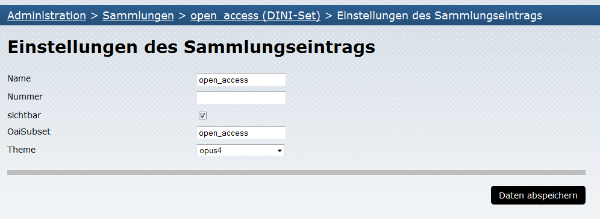

# Richtlinien für die OAI-Schnittstelle

## Set für Open-Access-Dokumente

Anforderung: Es existiert ein Set mit der Bezeichnung (setSpec) 'open_access'. Zu diesem Set gehören alle
Metadatensätze, die sich auf OpenAccess-Dokumente beziehen.

Ab der Version OPUS4.2.2 wird das Set "open_access" standardmäßig bei Neuinstallation mit angelegt. Daher entfallen für
Anwender, die originär mit der Version 4.2.2 starten, die unten aufgeführten Schritte.

Um diese Anforderung zu erfüllen, muss eine Sammlung "open_access" mit einem Sammlungseintrag "open_access" im Bereich
[Sammlungen verwalten](../admin/collections.html) angelegt werden:

{:width="640px"}

Der Parameter OAISubset hat den Wert: "open_access", die Option "sichtbar" ist ausgewählt.

Abschließend müssen nun die gewünschten Dokumente dem Sammlungseintrag (2. Ebene) zugeordnet werden. 
Die so zugeordneten Dokumente sind in den Ergebnislisten von [Suche](../features/search.html) und 
[Browsing](../features/browsing.html) mit einem Open-Access-Logo gekennzeichnet.

Die Konformität der OAI-Schnittstelle zum DINI-Zertifikat kann getestet werden.

