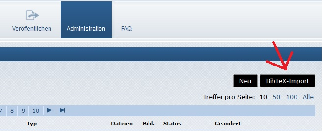
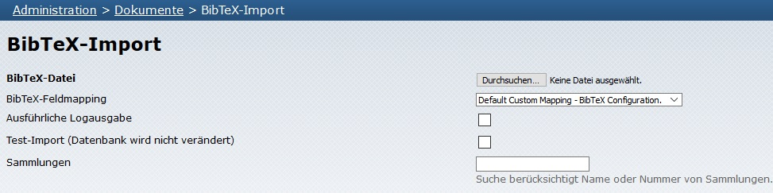

# BibTeX-Import

Ab der OPUS Version 4.7.1 können Dokumentmetadaten aus einer BibTeX-Datei, die beliebig viele BibTeX-Records enthält, sowohl über einen
**Kommandozeilen-Befehl** (CLI) als auch über ein **Web-Formular** im Administrationsbereich importiert werden.

Zur korrekten Verarbeitung der BibTeX-Dateien wird vom OPUS 4 BibTeX-Parser das Tool `Pandoc` benötigt. Siehe dazu mehr unter [Voraussetzungen](../installation/requirements.html#pandoc).

Aufruf des BibTeX-Imports auf der Kommandozeile:


$  bin/opus4 bibtex:import <filename.bib> 


In der Web-Oberfläche existiert im Administrationsbereich `Dokumente` dazu ein entsprechender Button `BibTeX-Import`.

{:width="500px"}

Der Import von BibTeX-Dateien über das Web-Formular bietet sämtliche Optionen an, die auch in der Kommandozeile angegeben werden können.

{:width="500px"}

Nach dem Import einer BibTeX-Datei (sowohl über CLI als auch Web-Oberfläche) wird ein Protokoll über die Verarbeitungsschritte ausgegeben,
aus dem u.a. hervorgeht, wieviele BibTeX-Einträge aus der zu importierenden Datei erfolgreich in die OPUS-Datenbank übernommen wurden.
Im Falle von Verarbeitungsfehlern erfolgt an dieser Stelle eine Ausgabe mit weiteren Details zur späteren Nachverfolgung.

Beim Import wird jeder in der BibTeX-Datei enthaltene BibTeX-Record auf ein OPUS-Metadatendokument abgebildet
(das sogenannte `Feld-Mapping`). Über eine Konfigurationsdatei lässt sich die Abbildung der einzelnen
BibTeX-Felder auf die OPUS-Metadatenfelder gezielt steuern.

Ferner kann die Abbildung der BibTeX-Dokumenttypen auf die Dokumenttypen von OPUS 4 ebenfalls über eine Konfigurationsdatei
gesteuert werden (das sogenannte `Dokumenttyp-Mapping`).

Das Importieren von BibTeX ohne Benutzerinteraktion ist kaum möglich, da es BibTeX-Dateien in vielen Varianten gibt, 
oft mit benutzerdefinierten Feldern, die nicht Teil eines Standards sind. 
Daher besteht die Möglichkeit, über benutzerdefinierte Zuordnungen und Interpretationen
der Felder in der spezifischen BibTeX-Datei zu entscheiden und individuelle Anpassungen vorzunehmen.

OPUS 4 liefert eine Standardkonfiguration für das Dokumenttyp- und Feld-Mapping, 
welche als Ausgangsbasis für eine instanzspezifische Konfiguration genutzt werden kann.

<p class="info">
Instanzspezifische Konfigurationen werden in der "$BASEDIR/application/configs/config.ini" deklariert.
</p>

## Import-Optionen

Sowohl der Kommandozeilen-Befehl für den BibTeX-Import, als auch das Web-Formular im Administrationsbereich, bieten
eine Reihe von Optionen, mit denen der Verarbeitungsprozess an die eigenen Bedürfnisse angepasst werden kann.

Auflistung der verfügbaren Optionen mit ihrer Bedeutung:


$ bin/opus4 help bibtex:import


Folgende Optionen werden angeboten:

### Angabe eines zu verwendenden Feld-Mappings:
Jedes Feld-Mapping wird durch eine JSON-Konfigurationsdatei definiert. Es können in einer Instanz mehrere 
Feld-Mappings vorhanden sein. Der Pfad zu den instanzspezifischen Feld-Mappings und deren Namen werden 
in der `config.ini` deklariert. 

Durch die Option `--mapping` oder `-m` kann ein angepasstes Feld-Mapping ausgewählt werden.
Im Webformular werden die Feld-Mappings über eine Selectliste ausgewählt. Die verfügbaren Feld-Mappings auf der
Kommandozeilen-Ebene können über folgenden Befehl aufgelistet werden:


$ bin/opus4 bibtex:list


Aufruf des BibTex-Imports mit Angabe eines Feld-Mappings:


$  bin/opus4 bibtex:import -m <Feld-Mapping-Name> <filename.bib>


Ohne Angabe des Parameters `-m` wird beim Importprozess das Default-Mapping verwendet.
  
### Verknüpfung mit Sammlungseinträgen:
 Mit der Option `--collection` oder `-c` lässt sich auf der Kommandozeile eine kommaseparierte Liste von 
Sammlungs-IDs angeben, mit denen jedes erfolgreich importierte Dokument verknüpft wird.
Hierbei werden unbekannte IDs ignoriert und es erfolgt ein entsprechender Hinweis in der Protokollausgabe.


$  bin/opus4 bibtex:import -c <Collection-ID-1>,<Collection-ID-2>,<Collection-ID-3> -m <Feld-Mapping-Name> <filename.bib>


<p class="info">
Im Webformular können vorhandene Sammlungen ausgewählt werden. Dafür muss in dem Feld "Sammlungen" der Name 
der Sammlung eingegeben werden. Es ist ausreichend, einen Teil des Namens einzugeben, da die Anzeige durch ein 
sogenanntes "Autocomplete" ergänzt wird. Das Hinzufügen mehrerer Sammlungen ist hier ebenfalls möglich.
</p>
  
### Verbose Mode:
Die Option `--verbose` oder `-v` erhöht die Anzahl der Meldungen, die in die Protokollausgabe geschrieben werden, 
so dass der Importprozess im Detail verfolgt werden kann. Es werden z.B. die IDs der neu erzeugten OPUS-Dokumente 
ausgegeben.


$  bin/opus4 bibtex:import -v -m <Feld-Mapping-Name> <filename.bib>


Im Webformular wird dieser Modus durch ein Häkchen aktiviert.
  
### Dry Mode:
Die Option `--dry` oder `-d` erlaubt einen Test-Import im "Trockendurchlauf", bei dem die Datenbank nicht verändert
wird. Dabei erfolgt das Parsen der BibTeX-Datei einschließlich der Erzeugung von OPUS-Dokumenten aus den in den 
BibTeX-Feldern gespeicherten Werten **ohne** dabei die erzeugten OPUS-Dokumente tatsächlich in die OPUS-Datenbank 
zu speichern. Dieser Modus bietet sich daher an, wenn eine BibTeX-Datei initial importiert werden soll und in 
einem ersten Schritt geprüft werden soll, ob der Import der Datei fehlerfrei möglich ist.


$  bin/opus4 bibtex:import -d -v -m <Feld-Mapping-Name> <filename.bib>


Im Webformular wird dieser Modus durch ein Häkchen aktiviert.
  
## Dokumenttyp-Mapping

Ein Dokumenttyp-Mapping bildet die BibTeX-Dokumenttypen auf die OPUS-Dokumenttypen ab. Im Dokumenttyp-Mapping 
können auch Nicht-Standard-BibTeX-Typen verwendet werden.

Das Mapping wird in einer INI-Konfigurationsdatei definiert und hat folgende Struktur (hier als Beispiel ein 
Auszug aus der Standard- Konfigurationsdatei `import.ini`):

```ini
; Mapping der BibTeX-Typen auf OPUS-Dokumenttypen
documentTypeMapping[article]    = article
documentTypeMapping[techreport] = report
```
Hier wird der BibTeX-Dokumenttyp `article` bzw. `techreport` auf den OPUS-Dokumenttyp `article` bzw. `report`
abgebildet.

Ferner ist es möglich, einen sogenannten "Fallback"-Dokumenttyp anzugeben, der immer dann zur Anwendung kommt, 
wenn für den vorliegenden BibTeX-Dokumenttyp kein Mapping konfiguriert wurde. In diesem Fall wird als 
OPUS-Dokumenttyp der Fallback-Dokumenttyp verwendet:

```ini
; Standard-OPUS-Dokumenttyp, sofern für den im BibTeX-Record vorliegenden BibTeX-Typ kein Typ-Mapping auf einen
; OPUS-Dokumenttyp existiert
defaultDocumentType = misc
```

**Instanzspezifische Anpassungen der Dokumenttypen**

Die Default-Datei für das Dokumenttyp-Mapping `src\Import\import.ini` gibt Auskunft über die vorhandenen 
Standard-Mappings. Diese Datei soll nicht verändert werden.
Sollen instanzspezifische Anpassungen der Dokumenttypen erfolgen, können diese in der 
`$BASEDIR/application/configs/config.ini` deklariert werden. 
<p class="info">
Entscheidend, ob ein Dokumenttyp-Mapping erfolgen 
muss, ist die Bezeichnung des Dokumenttyps in der zu importierenden BibTeX-Datei.
</p>
Beispiel:
Hier sind die Dokumenttypen in der BibTeX-Datei alle in Großbuchstaben und weichen dadurch vom Standard ab. 

```ini
bibtex.entryTypes.ARTICLE = article
bibtex.entryTypes.BOOK = book
bibtex.entryTypes.MASTERSTHESIS = masterthesis
bibtex.entryTypes.TECHREPORT = report
bibtex.entryTypes.PHDTHESIS = doctoralthesis
```

## Feld-Mapping

Ein Feld-Mapping definiert, wie die Inhalte der Felder eines BibTeX-Datensatzes auf die Felder eines 
OPUS-Dokuments abgebildet werden sollen. Die Konfigurationsmöglichkeiten sind mannigfaltig und reichen weit 
über einfache 1-zu-1-Mappings zwischen BibTeX-Feldern und OPUS-Metadatenfeldern hinaus. Eine ausführliche 
Beschreibung kann im OPUS 4 Modul [opus4-bibtex](https://github.com/OPUS4/opus4-bibtex/blob/master/README.md#field-mapping) nachgeschlagen
werden.

Ein Feld-Mapping wird in einer JSON-Datei beschrieben. Die Standard-Konfigurationsdatei 
`src\Import\default-mapping.json` kann auch hier als Ausgangspunkt für instanzspezifische Feld-Mappings genutzt werden.

<p class="info">
Für die instanzspezifische Bearbeitung der Feld-Mappings empfiehlt es sich, ein Custom-BibTeX-Ordner im 
Konfigurationsverzeichnis "/application/configs/" anzulegen und dort die Feld-Mapping-Dateien vorzuhalten. 
</p>

Jedes Feld-Mapping hat einen eindeutigen Namen, über den es beim Import (sowohl via Kommandozeile als auch über das
Import-Formular) referenziert werden kann. Z.B. enthält die Mapping-Datei `custom-mapping-xyz.json` folgende 
Referenzbezeichnung:


	"name": "xyz",
	"description": "XYZ Custom Mapping - BibTeX Configuration.",
	"mapping": 


Eine Instanz kann für die Verarbeitung unterschiedlicher BibTeX-Varianten mehrere Feld-Mappings besitzen.
Die einzelnen Feld-Mappings sind über ihren Dateinamen in der `config.ini` zu registrieren, ebenso der 
Verzeichnispfad zu den spezifischen JSON-Dateien.

```ini
; IMPORT SETTINGS
bibtex.mappingsBasePath = APPLICATION_PATH "/application/configs/bibtex"
bibtex.mappings.default.file = custom-default-mapping.json
bibtex.mappings.abc.file = custom-mapping-abc.json
bibtex.mappings.xyz.file = custom-mapping-xyz.json
```

Die vorhandenen Feld-Mappings lassen sich über die Kommandozeile mit folgendem Befehl anzeigen:


$ bin/opus4 bibtex:list


Die Ausgabe hätte dann z.B. folgendes Aussehen:


default - Default Custom Mapping - BibTeX Configuration.
abc - ABC Custom Mapping - BibTeX Configuration.
xyz - XYZ Custom Mapping - BibTeX Configuration.



**Anzeigename bzw. Übersetzungsschlüssel der Feld-Mapping-Dateien**

Im Web-Fomular kommt der Name der Feld-Mapping-Datei entweder aus dem Feld `Description` der JSON-Datei,
oder aus einem Übersetzungsschlüssel von OPUS. Der Übersetzungsschlüssel überschreibt das Description-Feld.

**Description-Feld**

```ini
"name": "xyz",
"description": "XYZ Custom Mapping - BibTeX Configuration."
```

**Übersetzungsschlüssel**

Schlüssel für die Übersetzung des Default Mappings:

`bibtex_mapping_description_default`

Schlüssel für die Übersetzung eines Custom Mappings:

`bibtex_mapping_description_xyz`

## Prozessierung der BibTeX-Datei

Die zu importierende BibTeX-Datei wird zuerst mit einem **BibTeX-Parser** ausgelesen und dabei in die einzelnen
BibTeX-Records aufgeteilt. Tritt dabei ein Fehler auf, z. B. weil die zu importierende Datei nicht konform zum
BibTeX-Standard ist, so wird der Import beendet. Es wird eine Fehlermeldung ausgegeben, die weitere Details zum Fehler,
beispielsweise die Zeilennummer, enthält.

Nach dem erfolgreichen Parsen der BibTeX-Datei erzeugt ein **BibTeX-Processor** aus jedem BibTeX-Record ein 
OPUS-Metadatendokument, und zwar auf Basis der Konfigurationseinstellungen.

Tritt während der Erzeugung eines OPUS-Metadatendokuments ein Fehler auf, so wird das Dokument verworfen und der
BibTeX-Processor springt zum nächsten BibTeX-Record bzw. beendet die Verarbeitung, wenn alle BibTeX-Records verarbeitet
wurden.

Wird der Import nicht im Trockenlauf-Modus gestartet, so wird vom BibTeX-Prozessor schließlich geprüft, ob bereits
ein OPUS-Metadatendokument in der Datenbank existiert, das aus einem identischen BibTeX-Record erzeugt wurde. Die
Prüfung erfolgt hierbei auf Basis einer Hashsumme, die für den BibTeX-Record ermittelt und in einem Enrichment
`opus.import.dataHash` gespeichert wird. Als Hashfunktion wird momentan `md5` verwendet. Der Name der verwendeten Hashfunktion wird
als Präfix (getrennt durch `:`) im Enrichment gespeichert.

Existiert in der OPUS-Datenbank bereits ein Dokument, das im Enrichment `opus.import.dataHash` einen Hashwert besitzt,
der mit dem Hashwert des aktuell vom BibTeX-Processor verarbeiteten BibTeX-Record übereinstimmt, so verwirft der
Prozessor das gerade in der Verarbeitung befindliche OPUS-Metadatendokument. Es erfolgt in diesem Fall keine
Speicherung des OPUS-Metadatendokuments in der Datenbank.

Diese Vorgehensweise ermöglicht das wiederholte Importieren von BibTeX-Dateien. So kann z. B. eine wachsende
BibTeX-Datei jährlich (oder häufiger, je nach Anwendungsfall) importiert werden und es ist dennoch sichergestellt, dass
beim Import keine Duplikate in der OPUS-Datenbank entstehen. Die zu importierende BibTeX-Datei muss vorher auch nicht
von den bereits in einem früheren Import in die OPUS-Datenbank eingefügten Dokumente befreit werden.

## Auszeichnung der OPUS-Metadatendokumente, die durch den BibTeX-Import erzeugt wurden

Jedes OPUS-Metadatendokument, das über den BibTeX-Import erzeugt wurde, erhält einige Enrichments, die es
eindeutig klassifizieren:

| Name des Enrichments   | Inhalt |
|------------------------|--------|
| `opus.import.data`     | enthält den ursprünglichen BibTeX-Record, aus dem das OPUS-Metadatendokument erzeugt wurde |
| `opus.import.dataHash` | enthält die Hashsumme des BibTeX-Records; der Name der verwendeten Hashfunktion wird als Präfix getrennt durch `:` angegeben |
| `opus.import.date`     | Importdatum |
| `opus.import.file`     | Name der BibTeX-Datei, aus dem der BibTeX-Record stammt |
| `opus.import.format`   | hat den festen Wert `bibtex` |
| `opus.import.id`       | eindeutige ID des Importvorgangs (jeder Importvorgang einer BibTeX-Datei erhält eine eindeutige ID) |

